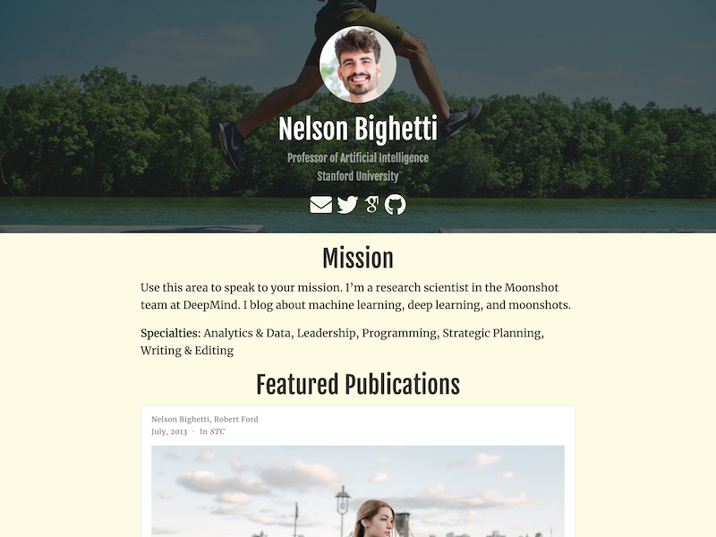

# Sponsors ✨

### ❤️ Thanks for supporting this open source movement ❤️

**In this repository, you can find content exclusive to *Creator+* Tier [Sponsors](https://github.com/sponsors/gcushen/)**

## Sponsors' Lounge

[Join the Sponsor' Lounge on Discord](https://discord.gg/zzRRfMnt)

If you don't have access yet, DM Geo (even if offline) on Discord so that we can assign the Sponsor role to your Discord account.

## Cheat Sheet

[View the Sponsors' cheat sheet for Hugo and Wowchemy](https://wowchemy.com/uploads/sponsors/Wowchemy_Hugo_Cheat_Sheet.pdf)

## Exclusive Templates

- [Online Fitness Coach template](./fitness-coach/)  
  
- [Researcher template](./researcher/)  
  

## Stickers

_Professional_ tier sponsors, please DM Geo (even if offline) on Discord with your full name and address so that we can send you the Academic sticker!

## Getting Started

- 📚 [View the **documentation**](https://wowchemy.com/docs/)
- 🚑 **Solve common issues** with the [Troubleshooting Guide](https://wowchemy.com/docs/guide/troubleshooting/)
- 💬 [Chat with the **Wowchemy community** on Discord](https://discord.gg/z8wNYzb)
  - For community support: _#need-help_ channel
  - For sponsors-only discussions: _#supporters-lounge_ channel
  - For feedback on GitHub Sponsors: DM _Geo#9051_
- 🐦 Share your site on Twitter: [@wowchemy](https://twitter.com/wowchemy) [@GeorgeCushen](https://twitter.com/GeorgeCushen) [#MadeWithWowchemy](https://twitter.com/search?q=(%23MadeWithWowchemy%20OR%20%23MadeWithAcademic)&src=typed_query)

## License

The templates/themes in this repository are licensed to "Creator" and "Professional" tier sponsors of George Cushen (sponsoring via GitHub Sponsors) under the Sponsor License (see attached LICENSE.md).
